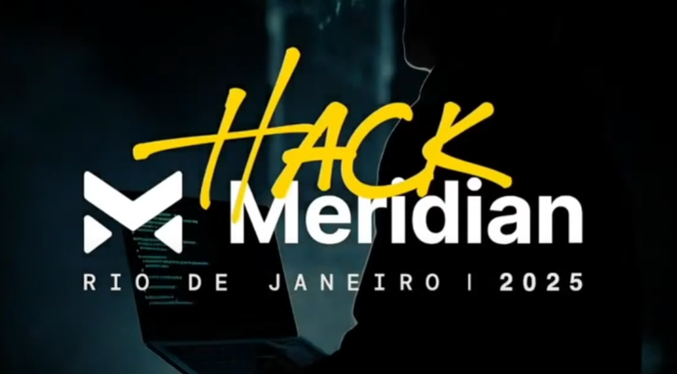

# Road to Meridian: Bootcamp Completo

## 🎯 Sobre o Meridian
**Meridian** é o maior evento global da Stellar, combinando hackathon + conferência. O evento acontecerá nos dias **17-18 de setembro de 2025** no **Copacabana Palace, Rio de Janeiro**.

---

## 📚 Estrutura dos Workshops

### [🔧 Workshop 1: Introdução ao Rust](./workshop1/README.md)
**Foco:** Fundamentos de Rust e desenvolvimento de aplicações básicas

#### **Aulas:**
- **[📖 Aula 1: Criar e Publicar Bibliotecas em Rust](./workshop1/aula1/README.md)**
  - ✅ Rust environment installation and setup
  - ✅ Hello World e primeiros passos
  - ✅ Types, functions, and modules
  - ✅ Criação de biblioteca calculadora
  - ✅ Testes automatizados
  - ✅ Publicação no Crates.io
  - ✅ Programa interativo com input do usuário

- **[🚀 Aula 2: Criar e Deployar Rest API CRUD em Rust](./workshop1/aula2/README.md)**
  - 🔄 Operações CRUD (Create, Read, Update, Delete)
  - 🛠️ Framework web Tide e runtime async-std
  - 🔒 Gerenciamento de estado concorrente com Arc<Mutex<HashMap>>
  - 📡 Endpoints REST API e métodos HTTP
  - 🧪 Testes manuais com cURL
  - 🚀 Deploy em produção com Railway

- **[🌐 Aula 3: Criar e Integrar WebAssembly em Rust](./workshop1/aula3/README.md)**
  - ⚡ Introdução ao WebAssembly (WASM, WASI, WAT)
  - 🔧 Compilação e otimização Rust para WASM
  - 🌐 Runtimes WebAssembly (Wasmi, Wasmtime, Wasmer)
  - 🚀 Integração com APIs CRUD (CRUDE - Create, Read, Update, Delete, Execute)
  - 🎯 Aplicações práticas e casos de uso blockchain

**[📋 Ver Workshop 1 completo](./workshop1/README.md)**

---

### [⭐ Workshop 2: Smartcontracts Básico na Stellar com Soroban](./workshop2/README.md)
**Foco:** Desenvolvimento de smart contracts na Stellar Network usando Rust e Soroban

#### **Aulas:**
- **[📖 Aula 1: Básico de Blockchain e Hello World](./workshop2/aula1/README.md)**
  - 🏗️ Fundamentos da blockchain (4 pilares)
  - ⭐ Stellar Network em detalhes
  - 🔧 Smart contracts na Stellar (Soroban)
  - 🚀 Demonstração prática: Hello World
  - 🧪 Testes e segurança básica

- **[🚀 Aula 2: Smartcontracts e Integração com Backend](./workshop2/aula2/README.md)**
  - 💾 Storage em smart contracts
  - 🔗 Integração com backend
  - 🔐 Segurança em integrações
  - 🏗️ Aplicação full-stack
  - 🧪 Testes de integração

- **[🌐 Aula 3: Smartcontracts e Integração com Frontend](./workshop2/aula3/README.md)**
  - 🌐 Frontend para smart contracts
  - 🔗 Integração frontend-backend
  - 👛 Wallet integration
  - 🎨 Interface de usuário
  - 🎯 Aplicação completa: Sistema de votação

**[📋 Ver Workshop 2 completo](./workshop2/README.md)**

---

### [🔐 Workshop 3: Smartcontracts Avançado na Stellar com Soroban](./workshop3/README.md)
**Foco:** Tópicos avançados e preparação para o hackathon Meridian

#### **Aulas:**
- **[📖 Aula 1: Segurança Avançada em Smartcontracts](./workshop3/aula1/README.md)**
  - 🔒 Vulnerabilidades comuns em smart contracts
  - 🛡️ Padrões de segurança avançados
  - 🔍 Técnicas de auditoria
  - 🧪 Testes de penetração
  - 📊 Análise estática de código

- **[🚀 Aula 2: Composabilidade entre Contratos](./workshop3/aula2/README.md)**
  - 🔗 Interação entre contratos
  - 🏗️ Padrões de composição
  - 📦 Arquiteturas modulares
  - 🔄 Callbacks e eventos
  - 🎯 DeFi patterns

- **[🔐 Aula 3: Autenticação Passkey e Tópicos Avançados](./workshop3/aula3/README.md)**
  - 🔑 Autenticação Passkey (FIDO)
  - ⚡ Otimizações de performance
  - 🎯 Padrões avançados
  - 🚀 Deploy em produção
  - 🔮 Futuro do Soroban

**[📋 Ver Workshop 3 completo](./workshop3/README.md)**

---

## 🏆 Desafios dos Workshops

### Workshop 1 - ✅ COMPLETADO
- ✅ **Desafio Aula 1**: Adicionar funções power e logarithm à biblioteca calculator
- ✅ **Desafio Aula 2**: Sistema completo de autenticação JWT + Refresh tokens
- ✅ **Desafio Aula 3**: API CRUDE com integração WASM + Cache + Rate limiting

### Workshop 2 - 🚧 EM ANDAMENTO
- 🔄 **Desafio Aula 1**: Reproduzir Hello World e criar variações
- 🔄 **Desafio Aula 2**: Sistema de votação com storage
- 🔄 **Desafio Aula 3**: Aplicação full-stack completa

### Workshop 3 - 📅 FUTURO
- 📋 **Desafio Aula 1**: Sistema de segurança multi-camadas
- 📋 **Desafio Aula 2**: Plataforma DeFi completa
- 📋 **Desafio Aula 3**: Aplicação enterprise inovadora

---

## 🚀 **Expansões de Desenvolvedor Sênior**

### **🎯 Implementações Avançadas**

Baseado em experiência de desenvolvimento backend sênior, os conceitos básicos do bootcamp foram expandidos em **aplicações de nível enterprise prontas para produção**:

#### **📦 Repositórios dos Projetos:**
- **[calculator](https://github.com/danielgorgonha/calculator)** - Biblioteca matemática avançada com funções power/logarithm
- **[interactive-calculator](https://github.com/danielgorgonha/interactive-calculator)** - Aplicação interativa funcional
- **[learn-rust-crud](https://github.com/danielgorgonha/learn-rust-crud)** - API CRUD + WASM pronta para produção

#### **🏆 Principais Conquistas:**
- **Excelência em Segurança**: Autenticação JWT + Refresh tokens + Acesso owner-only
- **Otimização de Performance**: Cache WASM + Rate limiting + Métricas abrangentes
- **Deploy em Produção**: APIs live no Railway com monitoramento
- **Estratégia de Testes**: Suites de testes automatizados com scripts shell
- **Documentação**: Docs completas da API + Collections Postman
- **Arquitetura Enterprise**: Design modular + Tratamento de erros + Logging

#### **💡 Práticas de Desenvolvedor Sênior Aplicadas:**
- **Escalabilidade**: Dos conceitos básicos às aplicações de produção
- **Security First**: Sistemas de autenticação e autorização
- **Performance Focus**: Cache, monitoramento e otimização
- **Testing Strategy**: Testes automatizados abrangentes
- **Documentation**: Documentação profissional e completa
- **Production Ready**: Deployado, monitorado e mantido

---

## 📚 Recursos Adicionais

### **Documentação Oficial**
- [📖 The Rust Programming Language Book](https://doc.rust-lang.org/book/) - Livro oficial do Rust
- [🔧 Rust Reference](https://doc.rust-lang.org/reference/) - Referência técnica completa
- [📚 Rust by Example](https://doc.rust-lang.org/rust-by-example/) - Aprenda Rust com exemplos
- [🛠️ Cargo Book](https://doc.rust-lang.org/cargo/) - Documentação do Cargo

### **Ecossistema Stellar**
- [⭐ Stellar Documentation](https://developers.stellar.org/) - Documentação oficial
- [🔧 Soroban Documentation](https://soroban.stellar.org/) - Smart contracts
- [💡 Stellar Quest](https://quest.stellar.org/) - Aprenda Stellar
- [🌐 Stellar Ecosystem](https://www.stellar.org/ecosystem) - Projetos e ferramentas

### **Ferramentas e IDEs**
- [🦀 rust-analyzer](https://rust-analyzer.github.io/) - Language server para IDEs
- [📝 VS Code Rust Extension](https://marketplace.visualstudio.com/items?itemName=rust-lang.rust-analyzer)
- [🐛 Rust Playground](https://play.rust-lang.org/) - Teste código online

### **Comunidade e Aprendizado**
- [💬 Rust Discord](https://discord.gg/rust-lang) - Comunidade oficial
- [📱 r/rust](https://reddit.com/r/rust) - Subreddit do Rust
- [🎯 Rustlings](https://github.com/rust-lang/rustlings) - Exercícios interativos
- [🏆 Rust Quiz](https://dtolnay.github.io/rust-quiz/) - Teste seu conhecimento

### **Desenvolvimento Web e APIs**
- [📖 Tide Documentation](https://docs.rs/tide) - Documentação oficial do framework Tide
- [🔧 Serde Documentation](https://serde.rs/) - Serialização/deserialização JSON
- [🌐 Railway Documentation](https://docs.railway.app/) - Plataforma de deploy na nuvem
- [📡 REST API Best Practices](https://restfulapi.net/) - Diretrizes de design de API

### **Testes e Ferramentas de Desenvolvimento**
- [🧪 Postman](https://www.postman.com/) - Testes e desenvolvimento de API
- [📱 Insomnia](https://insomnia.rest/) - Alternativa ao Postman
- [🔍 cURL Documentation](https://curl.se/docs/) - Cliente HTTP via linha de comando

### **Vídeos e Cursos**
- [🎥 Rust Tutorial for Beginners](https://www.youtube.com/watch?v=zF34dRivLOw)
- [📺 Let's Get Rusty](https://www.youtube.com/c/LetsGetRusty) - Canal especializado
- [🎓 Rust Crash Course](https://www.youtube.com/watch?v=zF34dRivLOw)

---

## 📅 Cronograma dos Workshops

### **Workshop 1 - ✅ COMPLETADO**
- **Aula 1**: Introdução ao Rust e bibliotecas
- **Aula 2**: APIs REST com Rust
- **Aula 3**: WebAssembly e integração

### **Workshop 2 - 🚧 EM ANDAMENTO**
- **Aula 1**: Básico de Blockchain e Hello World ✅
- **Aula 2**: Smartcontracts e Backend Integration 📅
- **Aula 3**: Smartcontracts e Frontend Integration 📅

### **Workshop 3 - 📅 FUTURO**
- **Aula 1**: Segurança Avançada 📅
- **Aula 2**: Composabilidade entre Contratos 📅
- **Aula 3**: Autenticação Passkey e Tópicos Avançados 📅

---

*Desenvolvido para Meridian Hackathon 2025 - Rio de Janeiro*
