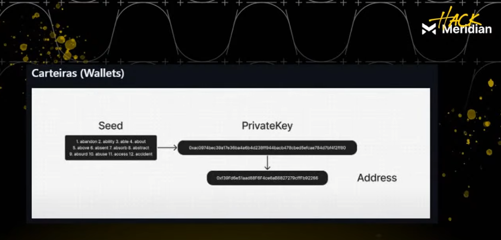
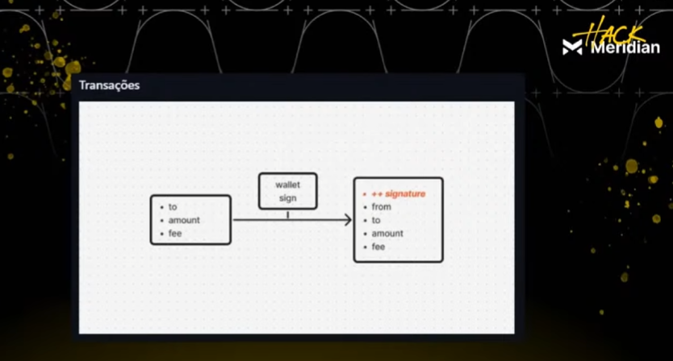
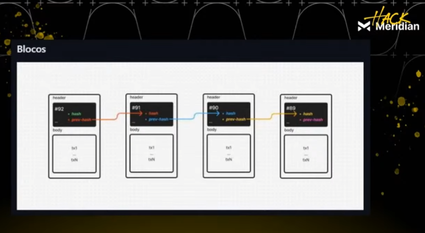
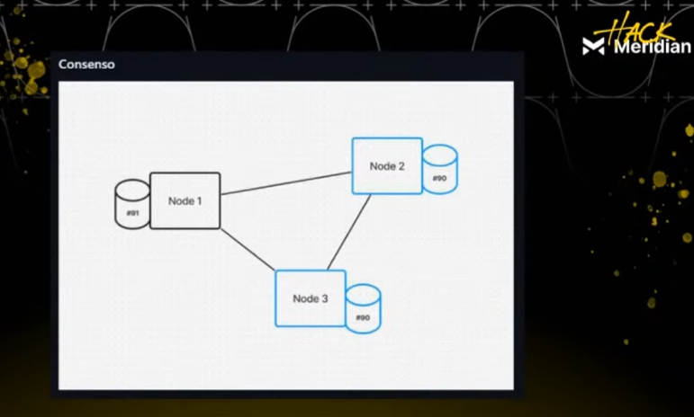
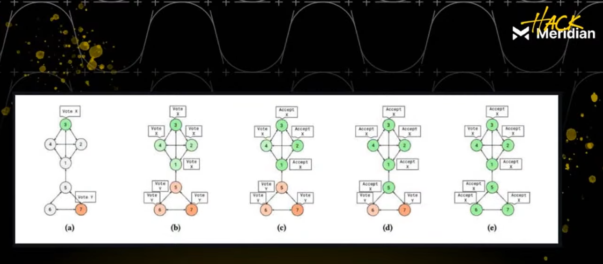
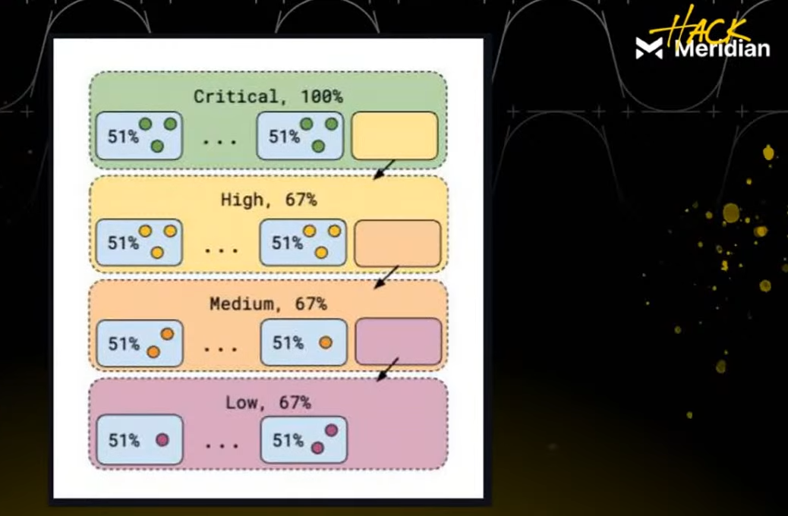
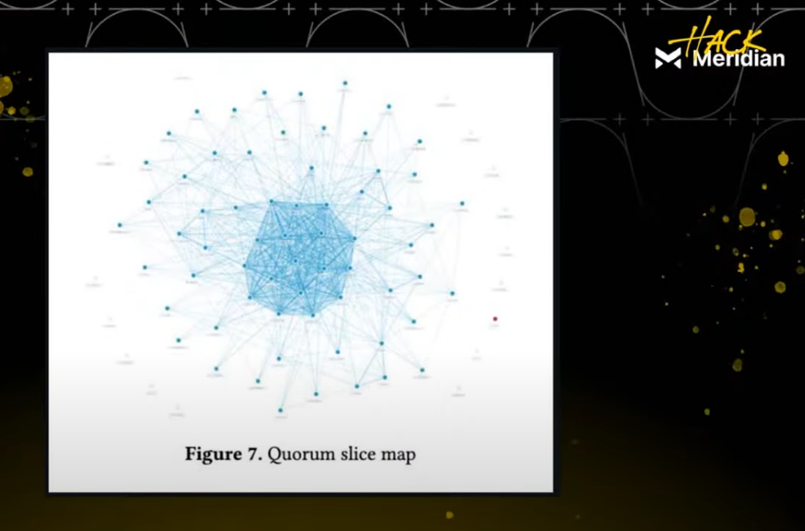

# Workshop 2: Smartcontracts Básico na Stellar com Soroban

## Aula 1: Básico de Blockchain e Hello World

### 📚 Resumo da Aula

Esta aula apresenta os fundamentos da blockchain e smart contracts na Stellar Network, com foco prático na criação e deploy do primeiro smart contract "Hello World" usando Rust e Soroban.

### 🎯 Objetivos da Aula

- ✅ Compreender os fundamentos da blockchain
- ✅ Entender a Stellar Network e seu ecossistema
- ✅ Conhecer o Soroban e smart contracts em Rust
- ✅ Configurar ambiente de desenvolvimento
- ✅ Criar e fazer deploy do primeiro smart contract

---

## 🏗️ Fundamentos da Blockchain

### Os 4 Pilares Fundamentais

#### 1. **Carteiras (Wallets)**


- **Função**: Armazenam chaves criptográficas (pública e privada)
- **Chave Pública**: Como um e-mail (identificação)
- **Chave Privada**: Como uma senha (controle)
- **Ciclo de Vida**: Criar par de chaves → Assinar transações → Enviar para blockchain

#### 2. **Transações**


- **Definição**: Instruções para a blockchain realizar ações
- **Exemplos**: Transferir tokens, NFTs, criar contas, interagir com smart contracts
- **Característica**: Alteram o "estado" da blockchain (salvo nos blocos)
- **Imutabilidade**: Registros passados são imutáveis

#### 3. **Blocos (Ledgers)**


- **Na Stellar**: Chamados de "ledgers"
- **Conteúdo**: Conjuntos de transações agrupadas, ordenadas e executadas
- **Estrutura**: 
  - **Header**: Metadados (número, hash, tempo de criação)
  - **Body**: Lista de transações
- **Encadeamento**: Blocos conectados criptograficamente através de hashes

#### 4. **Consenso**


- **Objetivo**: Garantir que todos os nós concordem sobre o próximo estado
- **Complexidade**: Problema da ciência da computação distribuída
- **Tipos**: Proof of Work (Bitcoin), Proof of Stake (Ethereum)

##### **🤝 Consenso na Stellar (SCP - Stellar Consensus Protocol)**

**Visão Geral do SCP**
O **Stellar Consensus Protocol (SCP)** é um protocolo de acordo bizantino federado (FBA) com **membresia aberta**. Diferente de outros protocolos de consenso, o SCP não requer mineração ou stake, oferecendo uma abordagem única para alcançar consenso distribuído.

**Características Principais**
- **Acordo Bizantino Federado (FBA)**: Resolve o problema dos generais bizantinos em redes federadas
- **Membresia Aberta**: Qualquer nó pode participar da rede
- **Sem Mineração**: Não requer poder computacional intensivo
- **Sem Stake**: Não requer depósito de tokens para participação
- **Transações Atômicas**: Garante atomicidade em todas as operações
- **Irreversibilidade**: Transações confirmadas são irreversíveis

**Mecanismo de Consenso**
```
Nós da Rede → Configuram Fatias de Quórum → Alcançam Consenso Global → Validação de Transações
```



**Hierarquia do Consenso:**


A hierarquia do consenso na Stellar segue uma estrutura em camadas que garante a segurança e eficiência da rede:

**Camadas da Hierarquia:**
1. **Camada de Aplicação**: Smart contracts e aplicações
2. **Camada de Consenso**: Protocolo SCP e validação
3. **Camada de Rede**: Comunicação entre nós
4. **Camada de Infraestrutura**: Hardware e conectividade

**Fluxo Hierárquico:**
```
Aplicação → Smart Contract → Transação → Consenso → Validação → Confirmação
```

**Componentes da Hierarquia:**
- **Validadores**: Nós que participam do consenso
- **Quorum Slices**: Grupos de validadores confiáveis
- **Consensus Rounds**: Rodadas de validação
- **Ledger Updates**: Atualizações do livro-razão

**Fatias de Quórum:**


As fatias de quórum são o coração do sistema de consenso da Stellar, criando uma rede de confiança distribuída:

**Estrutura das Fatias de Quórum:**
- **Definição**: Grupos de nós de confiança configurados por cada participante
- **Função**: Garantir que transações sejam validadas por nós confiáveis
- **Configuração**: Cada nó define quais outros nós considera confiáveis
- **Resultado**: Rede resiliente a falhas e ataques

**Como Funcionam:**
```
Nó A → Define: [Nó B, Nó C, Nó D] como confiáveis
Nó B → Define: [Nó A, Nó E, Nó F] como confiáveis
Nó C → Define: [Nó A, Nó B, Nó G] como confiáveis
```

**Características das Fatias:**
- **Sobreposição**: Fatias se sobrepõem criando redundância
- **Resistência**: Múltiplos caminhos para consenso
- **Flexibilidade**: Cada nó escolhe seus confiáveis
- **Escalabilidade**: Sistema cresce organicamente

**Configuração de Fatias:**
```rust
// Exemplo de configuração de fatia de quórum
struct QuorumSlice {
    validators: Vec<Validator>,
    threshold: u32,
    inner_slices: Vec<QuorumSlice>,
}

// Configuração típica
let my_quorum_slice = QuorumSlice {
    validators: vec![validator1, validator2, validator3],
    threshold: 2, // Precisa de 2 de 3 para consenso
    inner_slices: vec![],
};
```

**Vantagens do Sistema:**
- **Descentralização**: Não há autoridade central
- **Resiliência**: Falhas não comprometem a rede
- **Flexibilidade**: Configuração personalizada por nó
- **Segurança**: Múltiplas validações independentes

**Exemplo Prático:**
```bash
# Configurar fatia de quórum para um nó
stellar quorum set \
  --validators GABCDEF1234567890,GHIJKLM9876543210,GMNOPQR555666777 \
  --threshold 2 \
  --quorum-set-name "my-node-quorum"

# Resultado:
# Quorum Set: {
#   "validators": ["GABCDEF1234567890", "GHIJKLM9876543210", "GMNOPQR555666777"],
#   "threshold": 2,
#   "inner_quorum_sets": []
# }
```

**Monitoramento de Fatias:**
```bash
# Verificar fatias de quórum ativas
stellar quorum list

# Monitorar consenso em tempo real
stellar consensus stream --quorum-set "my-node-quorum"

# Verificar sobreposições de fatias
stellar quorum overlap --node GABCDEF1234567890
```

**Estatísticas da Rede Stellar**
- **Contas Ativas**: Mais de 3,3 milhões de contas
- **Throughput**: +15 TPS (Transações por segundo)
- **Tempo de Consenso**: 1.061 ms (milissegundos)
- **Atualização de Ledger**: 46 ms (milissegundos)

**Comparação com Outros Protocolos**

| Aspecto | Stellar (SCP) | Bitcoin (PoW) | Ethereum (PoS) |
|---------|---------------|---------------|----------------|
| **Tipo** | FBA | Proof of Work | Proof of Stake |
| **Velocidade** | 1.061 ms | ~10 minutos | ~12 segundos |
| **TPS** | 15+ | ~7 | ~15-30 |
| **Energia** | Baixa | Alta | Média |
| **Custo** | Muito baixo | Alto | Médio |
| **Escalabilidade** | Limitada | Limitada | Melhor |

**Vantagens do SCP**

*Eficiência Energética:*
- Não requer mineração intensiva
- Consumo de energia mínimo
- Sustentabilidade ambiental

*Velocidade:*
- Consenso em segundos
- Confirmações rápidas
- Ideal para pagamentos

*Custo:*
- Taxas muito baixas
- Sem custos de mineração
- Acessível para microtransações

*Segurança:*
- Resistente a ataques bizantinos
- Falha tolerante
- Consenso por reputação

**Processo de Consenso Detalhado**

```rust
// Exemplo conceitual do processo de consenso
struct ConsensusRound {
    ledger_number: u32,
    transactions: Vec<Transaction>,
    quorum_slices: Vec<QuorumSlice>,
    consensus_reached: bool,
}

impl ConsensusRound {
    fn validate_transaction(&self, tx: &Transaction) -> bool {
        // Verificar assinaturas
        // Validar sequência
        // Verificar saldo
        // Aplicar regras de negócio
        true
    }
    
    fn reach_consensus(&mut self) -> bool {
        // Coletar votos dos nós
        // Verificar fatias de quórum
        // Alcançar acordo bizantino
        // Confirmar transações
        self.consensus_reached = true;
        true
    }
}
```

**Configuração de Fatias de Quórum**

```bash
# Exemplo de configuração de quórum slice
stellar quorum set \
  --validators VALIDATOR1,VALIDATOR2,VALIDATOR3 \
  --threshold 2 \
  --quorum-set-name "my-quorum"

# Resultado:
# Quorum Set: {
#   "validators": ["VALIDATOR1", "VALIDATOR2", "VALIDATOR3"],
#   "threshold": 2,
#   "inner_quorum_sets": []
# }
```

**Monitoramento de Consenso**

```bash
# Verificar status da rede
stellar network status

# Monitorar consenso em tempo real
stellar consensus stream

# Verificar validadores ativos
stellar validators list
```

**Casos de Uso Ideais**

*Pagamentos Globais:*
- Transações rápidas e baratas
- Confirmação em segundos
- Ideal para remessas internacionais

*Microtransações:*
- Custos muito baixos
- Escalabilidade adequada
- Perfeito para micropagamentos

*Aplicações DeFi:*
- Smart contracts rápidos
- Baixas taxas de execução
- Confirmações confiáveis

**Limitações e Considerações**

*Escalabilidade:*
- Limite de ~15 TPS
- Adequado para pagamentos, não para alta frequência
- Trade-off entre descentralização e performance

*Configuração:*
- Requer configuração manual de quórum slices
- Complexidade para novos participantes
- Necessidade de entender o protocolo

*Centralização:*
- Tendência a centralização em validadores principais
- Dependência de nós confiáveis
- Risco de cartelização

---

## ⭐ Stellar Network em Detalhe

### 🎯 Foco e Propósito
- **Objetivo**: Pagamentos globais rápidos e baratos
- **Diferencial**: Não se destina a memecoins ou NFTs
- **História**: Fundada em 2014 por Jed McCaleb (também fundador de Mt. Gox e Ripple)
- **Smart Contracts**: Lançados em 2023

### 💰 Tokenomics


- **Token**: Stellar Lumens (XLM)
- **Fornecimento Inicial**: 100 bilhões
- **Queima de 2019**: 55 bilhões queimados
- **Inflação**: Removida (era 1% anual)
- **Circulação Atual**: 31,28 bilhões XLM
- **Capitalização**: Mais de $13 bilhões

### 🔐 Criptografia e Chaves

#### **Curvas Elípticas**
A Stellar utiliza a **curva elíptica ED25519**, que é diferente da curva secp256k1 usada pelo Bitcoin e Ethereum. Esta escolha oferece:

- **Segurança Superior**: ED25519 é considerada mais segura contra ataques quânticos
- **Performance Melhor**: Operações mais rápidas que secp256k1
- **Tamanho Menor**: Chaves públicas de 32 bytes vs 33 bytes do Bitcoin
- **Eficiência**: Menor uso de CPU e memória

#### **Algoritmos de Hash**
A Stellar utiliza dois algoritmos de hash principais:

- **SHA256**: Função hash criptográfica de 256 bits
  - Usado para: Assinaturas de transações, geração de IDs
  - Características: Determinístico, resistente a colisões
  
- **RIPEMD160**: Função hash de 160 bits
  - Usado para: Geração de endereços públicos
  - Características: Complementa SHA256, reduz tamanho do endereço

#### **Geração de Endereços**
```
Chave Privada (32 bytes) → ED25519 → Chave Pública (32 bytes) → SHA256 + RIPEMD160 → Endereço (35 bytes)
```

#### **Formato de Endereços**
- **Mainnet**: Começam com 'G' (ex: GABCD...)
- **Testnet**: Começam com 'S' (ex: SABCD...)
- **Futurenet**: Começam com 'T' (ex: TABCD...)

#### **Exemplo Prático**
```bash
# Gerar par de chaves
stellar keys generate

# Resultado:
# Secret: SABCDEF1234567890...
# Public: GABCDEF1234567890...
```

#### **Segurança Criptográfica**
- **Chave Privada**: Nunca compartilhe ou exponha
- **Backup Seguro**: Armazene em local seguro offline
- **Hardware Wallets**: Use para maior segurança
- **Multi-signature**: Configure para contas importantes
- **Rotação de Chaves**: Troque chaves periodicamente

#### **Comparação com Outras Blockchains**
| Blockchain | Curva Elíptica | Tamanho Chave | Algoritmo Hash |
|------------|----------------|---------------|----------------|
| **Stellar** | ED25519 | 32 bytes | SHA256 + RIPEMD160 |
| **Bitcoin** | secp256k1 | 33 bytes | SHA256 |
| **Ethereum** | secp256k1 | 33 bytes | Keccak-256 |

### 🌐 Tipos de Rede

#### **Mainnet (Rede Pública)**
- Tokens XLM têm valor real
- Ambiente de produção

#### **Testnet**
- Similar à Mainnet
- Tokens sem valor
- 10.000 XLM gratuitos para testes

#### **Futurenet**
- Rede de desenvolvimento
- Novas funcionalidades
- Mais instável, com mais reinícios

### 👤 Contas
- **Modelo**: Baseado em contas (account-based, similar ao Ethereum)
- **Saldo Mínimo**: 1 XLM para existir na blockchain
- **Data Entries**: 0,5 XLM adicionais por cada "data entry" criada

### 💸 Transações na Stellar

#### **Estrutura de Transações**
Cada transação na Stellar possui uma estrutura bem definida:

```rust
struct Transaction {
    source_account: String,      // Conta que inicia a transação
    fee: u32,                   // Taxa em stroops
    sequence_number: u64,        // Número sequencial da conta
    time_bounds: TimeBounds,     // Limites de tempo (opcional)
    memo: Memo,                 // Memo da transação (opcional)
    operations: Vec<Operation>,  // Lista de operações
    signatures: Vec<Signature>   // Assinaturas
}
```

#### **Tipos de Operações (26 tipos)**
A Stellar suporta 26 tipos diferentes de operações:

**Operações Básicas:**
- `CREATE_ACCOUNT` - Criar nova conta
- `PAYMENT` - Transferir XLM ou tokens
- `PATH_PAYMENT_STRICT_SEND` - Pagamento com pathfinding
- `PATH_PAYMENT_STRICT_RECEIVE` - Recebimento com pathfinding

**Operações de Conta:**
- `SET_OPTIONS` - Configurar opções da conta
- `CHANGE_TRUST` - Alterar confiança em tokens
- `ALLOW_TRUST` - Permitir confiança em tokens
- `ACCOUNT_MERGE` - Mesclar contas

**Operações de Smart Contract:**
- `INVOKE_HOST_FUNCTION` - Invocar função do Soroban
- `BUMP_FOOTPRINT_EXPIRATION` - Estender expiração do footprint
- `RESTORE_FOOTPRINT` - Restaurar footprint

#### **Taxas e Custos**
- **Taxa Base**: 100 stroops (0,001 XLM) por operação
- **Stroop**: Menor unidade do XLM (1 XLM = 100.000.000 stroops)
- **Taxa Dinâmica**: Pode variar baseada na carga da rede
- **Múltiplas Operações**: Até 100 operações por transação

#### **Exemplo de Transação**
```bash
# Criar transação de pagamento
stellar transaction create \
  --source GABCDEF1234567890... \
  --destination GHIJKLM9876543210... \
  --amount 100 \
  --asset XLM

# Resultado:
# Transaction Hash: abc123def456...
# Fee: 100 stroops
# Operations: 1
```

#### **Características Únicas**
- **Atomicidade**: Todas as operações em uma transação são executadas ou nenhuma
- **Irreversibilidade**: Transações confirmadas não podem ser revertidas
- **Velocidade**: Confirmação em 3-5 segundos
- **Baixo Custo**: Taxas muito baixas comparadas a outras blockchains

#### **Transações com Smart Contracts**
```bash
# Invocar smart contract
stellar contract invoke \
  --id CONTRACT_ID \
  --source WALLET_KEY \
  -- hello message "Hello World"

# Resultado:
# Transaction Hash: xyz789abc123...
# Fee: 100 stroops
# Gas Used: 1000
# Result: ["Hello", "Hello World"]
```

#### **Validação de Transações**
```rust
// Verificar assinatura de transação
pub fn verify_transaction_signature(
    transaction: &Transaction,
    public_key: &PublicKey,
    signature: &Signature
) -> bool {
    // Verificar usando ED25519
    public_key.verify(transaction.hash(), signature)
}

// Validar estrutura da transação
pub fn validate_transaction(transaction: &Transaction) -> Result<(), Error> {
    // Verificar sequência
    if transaction.sequence_number == 0 {
        return Err(Error::InvalidSequence);
    }
    
    // Verificar taxa mínima
    if transaction.fee < MIN_FEE {
        return Err(Error::InsufficientFee);
    }
    
    // Verificar número de operações
    if transaction.operations.len() > MAX_OPERATIONS {
        return Err(Error::TooManyOperations);
    }
    
    Ok(())
}
```

#### **Monitoramento de Transações**
```bash
# Verificar status de transação
stellar transaction show TRANSACTION_HASH

# Monitorar transações em tempo real
stellar transaction stream --cursor now

# Verificar transações de uma conta
stellar transaction list --account GABCDEF1234567890...
```

### 📚 Ledgers (Blocos)
- **Frequência**: Novo ledger a cada 5 a 7 segundos
- **Capacidade**: Até 2.000 operações por ledger
- **Throughput**: 8.600 a 10.300 ledgers/dia


## 🔧 Smart Contracts na Stellar (Soroban)

### 📖 Sobre o Soroban
- **Nome**: Referência ao ábaco japonês
- **Lançamento**: Mainnet em 2024 (tecnologia muito recente)
- **Pilares**: Desempenho, sustentabilidade e segurança

### ⚡ Runtime
- **Tecnologia**: WebAssembly (WASM)
- **Vantagens**: Alta performance, portabilidade e segurança

### 🦀 Rust + WASM + Soroban DSL

#### **Rust como Linguagem Principal**
- **Rust**: Linguagem primária para smart contracts
- **Vantagens**:
  - Segurança de memória (sem garbage collector)
  - Alta performance (próxima a C/C++)
  - Sistema de tipos robusto
  - Comunidade ativa
- **Criador**: Graydon Hoare (criador do Rust) foi desenvolvedor dos smart contracts da Stellar

#### **WebAssembly (WASM)**

**O que é WebAssembly?**
WebAssembly é um formato de código binário de baixo nível que roda em uma máquina virtual baseada em pilha. É projetado para ser um alvo de compilação para linguagens de alto nível, permitindo deploy na web e em outros ambientes.

**Compilação Rust → WASM:**
```rust
// Compilação Rust → WASM
#![no_std]  // Sem biblioteca padrão para reduzir tamanho
use soroban_sdk::{contractimpl, Env, String, Vec};

// O código Rust é compilado para WASM
// WASM oferece:
// - Portabilidade: Roda em qualquer ambiente
// - Performance: Próximo ao código nativo
// - Segurança: Sandbox isolado
// - Tamanho: Binários compactos
```

**Características do WASM:**
- **Format Binário**: Código compilado em formato binário
- **Máquina Virtual**: Executa em VM baseada em pilha
- **Sandbox**: Execução isolada e segura
- **Cross-Platform**: Funciona em qualquer sistema operacional
- **Performance**: Próximo ao código nativo (C/C++)
- **Tamanho**: Binários compactos e eficientes

#### **VMs e Runtimes do WebAssembly**

**1. Wasmtime (Runtime Principal do Soroban)**
```rust
// Wasmtime é o runtime principal usado pelo Soroban
// Características:
// - Alto desempenho
// - Segurança robusta
// - Suporte completo ao WASI
// - Integração nativa com Rust

// Exemplo de uso do Wasmtime
use wasmtime::{Engine, Module, Store, Instance};

fn run_wasm_with_wasmtime(wasm_bytes: &[u8]) -> Result<(), Box<dyn std::error::Error>> {
    // Criar engine do Wasmtime
    let engine = Engine::default();
    
    // Compilar módulo WASM
    let module = Module::new(&engine, wasm_bytes)?;
    
    // Criar store (ambiente de execução)
    let mut store = Store::new(&engine, ());
    
    // Instanciar módulo
    let instance = Instance::new(&mut store, &module, &[])?;
    
    // Executar função
    let func = instance.get_func(&mut store, "hello").unwrap();
    func.call(&mut store, &[], &mut [])?;
    
    Ok(())
}
```

**2. Wasmi (Runtime Alternativo)**
```rust
// Wasmi é um runtime WASM escrito em Rust
// Características:
// - Implementação pura em Rust
// - Menor overhead
// - Ideal para embedded systems
// - Fácil integração com projetos Rust

use wasmi::{ImportsBuilder, ModuleInstance, NopExternals, RuntimeValue};

fn run_wasm_with_wasmi(wasm_bytes: &[u8]) -> Result<(), Box<dyn std::error::Error>> {
    // Carregar módulo WASM
    let module = wasmi::Module::from_buffer(wasm_bytes)?;
    
    // Criar instância
    let instance = ModuleInstance::new(
        &module,
        &ImportsBuilder::default()
    )?.assert_no_start();
    
    // Executar função
    let result = instance.invoke_export(
        "hello",
        &[],
        &mut NopExternals,
    )?;
    
    println!("Result: {:?}", result);
    Ok(())
}
```

**3. Wasmer (Runtime Universal)**
```rust
// Wasmer é um runtime universal para WASM
// Características:
// - Suporte a múltiplas plataformas
// - Compilação JIT
// - Plugins e extensões
// - Comunidade ativa

// Exemplo de uso do Wasmer
use wasmer::{Store, Module, Instance, imports};

fn run_wasm_with_wasmer(wasm_bytes: &[u8]) -> Result<(), Box<dyn std::error::Error>> {
    // Criar store
    let mut store = Store::default();
    
    // Compilar módulo
    let module = Module::new(&store, wasm_bytes)?;
    
    // Criar imports (se necessário)
    let import_object = imports! {};
    
    // Instanciar
    let instance = Instance::new(&mut store, &module, &import_object)?;
    
    // Executar função
    let func = instance.exports.get_function("hello")?;
    let result = func.call(&mut store, &[])?;
    
    println!("Result: {:?}", result);
    Ok(())
}
```

#### **Comparação dos Runtimes**

| Runtime | Linguagem | Performance | Tamanho | Uso Principal |
|---------|-----------|-------------|---------|---------------|
| **Wasmtime** | Rust | ⭐⭐⭐⭐⭐ | Médio | Soroban, Produção |
| **Wasmi** | Rust | ⭐⭐⭐⭐ | Pequeno | Embedded, IoT |
| **Wasmer** | Rust | ⭐⭐⭐⭐⭐ | Grande | Universal, Plugins |

#### **Arquitetura da VM WASM**

**1. Stack Machine:**
```rust
// WASM usa uma máquina baseada em pilha
// Exemplo de operações:
// 
// Código Rust:
// let result = a + b * c;
//
// WASM equivalente:
// local.get $a      // Empilha valor de 'a'
// local.get $b      // Empilha valor de 'b'
// local.get $c      // Empilha valor de 'c'
// i32.mul          // Remove b e c, empilha b*c
// i32.add          // Remove a e (b*c), empilha resultado
```

**2. Memory Management:**
```rust
// WASM tem memória linear gerenciada
// Exemplo de acesso à memória:
#[no_mangle]
pub extern "C" fn allocate_memory(size: u32) -> *mut u8 {
    // Alocar memória no heap WASM
    let layout = std::alloc::Layout::from_size_align(size as usize, 8).unwrap();
    unsafe { std::alloc::alloc(layout) }
}

#[no_mangle]
pub extern "C" fn free_memory(ptr: *mut u8, size: u32) {
    // Liberar memória do heap WASM
    let layout = std::alloc::Layout::from_size_align(size as usize, 8).unwrap();
    unsafe { std::alloc::dealloc(ptr, layout) }
}
```

**3. Function Calls:**
```rust
// Chamadas de função em WASM
#[no_mangle]
pub extern "C" fn add(a: i32, b: i32) -> i32 {
    a + b
}

#[no_mangle]
pub extern "C" fn complex_calculation(x: f64, y: f64) -> f64 {
    x * x + y * y
}
```

#### **WASM no Contexto do Soroban**

**1. Runtime Específico do Soroban:**
```rust
// Soroban usa uma versão customizada do Wasmtime
// com otimizações específicas para smart contracts

// Características do runtime Soroban:
// - Sandbox isolado por contrato
// - Limites de memória e CPU
// - Sistema de gas otimizado
// - Integração com Stellar Network
```

**2. Otimizações Específicas:**
```rust
// Otimizações do runtime Soroban
#[contractimpl]
impl MyContract {
    pub fn optimized_function(env: Env) -> String {
        // O runtime Soroban otimiza:
        // - Acesso ao storage
        // - Operações de criptografia
        // - Serialização de dados
        // - Gerenciamento de memória
        
        String::from_slice(&env, "optimized")
    }
}
```

**3. Debugging e Profiling:**
```bash
# Debugging do runtime WASM
wasm-objdump -x contract.wasm

# Profiling de performance
wasmtime --profile contract.wasm

# Análise de memória
wasmtime --memory-pooling contract.wasm
```

#### **WASM Tools e Ferramentas**

**1. Compilação e Otimização:**
```bash
# Compilar Rust para WASM
cargo build --target wasm32-unknown-unknown --release

# Otimizar WASM
wasm-opt -O4 -o optimized.wasm contract.wasm

# Analisar WASM
wasm-objdump -x contract.wasm
wasm-validate contract.wasm
```

**2. Debugging:**
```bash
# Debug com source maps
wasm-pack build --debug

# Profiling
wasmtime --profile contract.wasm

# Memory analysis
wasmtime --memory-pooling contract.wasm
```

**3. Testing:**
```rust
// Testes com diferentes runtimes
#[cfg(test)]
mod tests {
    use super::*;
    
    #[test]
    fn test_wasmtime() {
        // Teste com Wasmtime
        let wasm_bytes = include_bytes!("../target/wasm32-unknown-unknown/release/contract.wasm");
        run_wasm_with_wasmtime(wasm_bytes).unwrap();
    }
    
    #[test]
    fn test_wasmi() {
        // Teste com Wasmi
        let wasm_bytes = include_bytes!("../target/wasm32-unknown-unknown/release/contract.wasm");
        run_wasm_with_wasmi(wasm_bytes).unwrap();
    }
}
```

#### **Performance e Otimizações**

**1. Otimizações de Compilação:**
```toml
# Cargo.toml
[profile.release]
opt-level = 3
lto = true
codegen-units = 1
panic = 'abort'

[target.wasm32-unknown-unknown]
rustflags = [
    "-C", "target-feature=+crt-static",
    "-C", "link-arg=--import-memory",
]
```

**2. Otimizações de Runtime:**
```rust
// Otimizações específicas para WASM
#[no_mangle]
pub extern "C" fn optimized_function() -> i32 {
    // Use tipos nativos quando possível
    let result: i32 = 42;
    result
}

// Evite alocações desnecessárias
pub fn no_allocation(env: &Env) -> &'static str {
    "static_string"
}
```

**3. Memory Management:**
```rust
// Gerenciamento eficiente de memória
pub struct MemoryManager;

impl MemoryManager {
    // Pool de memória para reutilização
    pub fn get_memory_pool() -> Vec<u8> {
        // Implementação de pool de memória
        vec![0; 1024]
    }
    
    // Alocação otimizada
    pub fn allocate_optimized(size: usize) -> *mut u8 {
        // Alocação otimizada para WASM
        std::ptr::null_mut()
    }
}
```

O entendimento dos VMs e runtimes do WebAssembly é fundamental para otimizar smart contracts no Soroban e aproveitar ao máximo a performance e segurança oferecidas pela tecnologia WASM! 🚀

#### **Soroban DSL (Domain Specific Language)**

O **Soroban DSL** é um conjunto de macros e abstrações que facilitam o desenvolvimento de smart contracts:

**Macros Principais:**
```rust
// 1. contractimpl - Implementa o contrato
#[contractimpl]
impl MyContract {
    // Funções do contrato
}

// 2. contracttype - Define tipos serializáveis
#[contracttype]
#[derive(Clone, Debug, Eq, PartialEq)]
pub struct MyData {
    pub field1: String,
    pub field2: u32,
}

// 3. symbol_short! - Cria símbolos otimizados
use soroban_sdk::symbol_short;
let key = symbol_short!("my_key");

// 4. symbol! - Cria símbolos completos
use soroban_sdk::symbol;
let key = symbol!(&env, "my_key");
```

**Exemplo Completo com DSL:**
```rust
#![no_std]
use soroban_sdk::{
    contractimpl, contracttype, symbol_short, 
    Env, String, Vec, Address, Symbol
};

// Define tipo de dados do contrato
#[contracttype]
#[derive(Clone, Debug, Eq, PartialEq)]
pub struct User {
    pub address: Address,
    pub name: String,
    pub balance: u32,
}

// Define tipo para storage
#[contracttype]
#[derive(Clone, Debug, Eq, PartialEq)]
pub struct DataKey {
    pub user: Address,
    pub field: Symbol,
}

// Implementa o contrato usando DSL
pub struct UserContract;

#[contractimpl]
impl UserContract {
    // Função para criar usuário
    pub fn create_user(env: Env, address: Address, name: String) -> User {
        let user = User {
            address: address.clone(),
            name,
            balance: 0,
        };
        
        // Salva no storage usando DSL
        let key = DataKey {
            user: address,
            field: symbol_short!("user_data"),
        };
        
        env.storage().set(&key, &user);
        user
    }
    
    // Função para obter usuário
    pub fn get_user(env: Env, address: Address) -> Option<User> {
        let key = DataKey {
            user: address,
            field: symbol_short!("user_data"),
        };
        
        env.storage().get(&key)
    }
    
    // Função para atualizar saldo
    pub fn update_balance(env: Env, address: Address, amount: u32) -> bool {
        let key = DataKey {
            user: address.clone(),
            field: symbol_short!("user_data"),
        };
        
        if let Some(mut user) = env.storage().get(&key) {
            user.balance += amount;
            env.storage().set(&key, &user);
            true
        } else {
            false
        }
    }
    
    // Função para listar usuários (exemplo)
    pub fn list_users(env: Env) -> Vec<Address> {
        // Implementação para listar usuários
        Vec::new(&env)
    }
}
```

#### **Vantagens do Soroban DSL**

**1. Simplicidade:**
```rust
// Sem DSL (mais verboso)
let key = Symbol::new(&env, "user_data");
env.storage().set(&key, &data);

// Com DSL (mais simples)
let key = symbol_short!("user_data");
env.storage().set(&key, &data);
```

**2. Type Safety:**
```rust
// O DSL garante tipos corretos em tempo de compilação
#[contracttype]
pub struct MyStruct {
    pub field1: String,  // Tipo garantido
    pub field2: u32,     // Tipo garantido
}
```

**3. Otimização Automática:**
```rust
// symbol_short! cria símbolos otimizados
let key1 = symbol_short!("key");  // Otimizado
let key2 = symbol!(&env, "key");  // Completo
```

**4. Serialização Automática:**
```rust
// O DSL cuida da serialização/deserialização
#[contracttype]
pub struct ComplexData {
    pub users: Vec<User>,
    pub metadata: String,
    pub timestamp: u64,
}
```

#### **Padrões Avançados com DSL**

**1. Eventos e Logs:**
```rust
use soroban_sdk::{log, symbol_short};

pub fn log_event(env: &Env, event_type: &str, data: &str) {
    log!(&env, "Event: {} - {}", event_type, data);
}

// Uso
log_event(&env, "user_created", &format!("Address: {}", address));
```

**2. Validação com DSL:**
```rust
use soroban_sdk::{Error, symbol_short};

pub fn validate_input(input: &str) -> Result<(), Error> {
    if input.len() > 100 {
        return Err(Error::from_type_and_code(1, 1));
    }
    Ok(())
}
```

**3. Storage Patterns:**
```rust
// Padrão de storage com DSL
pub struct StoragePattern;

impl StoragePattern {
    // Storage simples
    pub fn set_simple(env: &Env, key: &str, value: &String) {
        let key = symbol_short!(key);
        env.storage().set(&key, value);
    }
    
    // Storage com namespace
    pub fn set_namespaced(env: &Env, namespace: &str, key: &str, value: &String) {
        let full_key = format!("{}:{}", namespace, key);
        let key = symbol!(&env, &full_key);
        env.storage().set(&key, value);
    }
    
    // Storage com TTL (Time To Live)
    pub fn set_with_ttl(env: &Env, key: &str, value: &String, ttl: u32) {
        let key = symbol_short!(key);
        env.storage().set_with_ttl(&key, value, ttl);
    }
}
```

#### **Compilação e Otimização**

**1. Compilação para WASM:**
```bash
# Compilar para WASM
cargo build --target wasm32-unknown-unknown --release

# Otimizar WASM
wasm-opt -O4 -o optimized.wasm target/wasm32-unknown-unknown/release/contract.wasm

# Usar ferramentas do Soroban
stellar contract build
stellar contract optimize
```

**2. Análise de Tamanho:**
```bash
# Verificar tamanho do WASM
ls -la target/wasm32-unknown-unknown/release/*.wasm

# Análise detalhada
wasm-objdump -x contract.wasm
```

**3. Debugging com DSL:**
```rust
// Debugging em desenvolvimento
#[cfg(test)]
mod test {
    use super::*;
    
    #[test]
    fn test_contract() {
        let env = Env::default();
        let contract = UserContract;
        
        // Teste com DSL
        let user = contract.create_user(&env, Address::random(&env), String::from_slice(&env, "Alice"));
        assert_eq!(user.balance, 0);
    }
}
```

#### **Integração com Ferramentas**

**1. Stellar CLI:**
```bash
# Deploy com DSL
stellar contract deploy --wasm contract.wasm --source WALLET

# Invoke com DSL
stellar contract invoke --id CONTRACT_ID --source WALLET -- create_user address "G..." name "Alice"
```

**2. Testing Framework:**
```rust
// Testes com DSL
#[cfg(test)]
mod test {
    use super::*;
    use soroban_sdk::testutils::{Address as _,};
    
    #[test]
    fn test_user_creation() {
        let env = Env::default();
        let contract = UserContract;
        
        let address = Address::random(&env);
        let name = String::from_slice(&env, "Test User");
        
        let user = contract.create_user(&env, address.clone(), name.clone());
        
        assert_eq!(user.address, address);
        assert_eq!(user.name, name);
        assert_eq!(user.balance, 0);
    }
}
```

#### **Performance e Otimizações**

**1. Otimizações de Código:**
```rust
// Evitar alocações desnecessárias
pub fn optimized_function(env: &Env) -> String {
    // Use string literals quando possível
    String::from_slice(env, "static_string")
}

// Use referências quando possível
pub fn process_data(env: &Env, data: &[u8]) -> Vec<u8> {
    // Processamento otimizado
    data.to_vec()
}
```

**2. Storage Otimizado:**
```rust
// Use símbolos otimizados
let key = symbol_short!("frequent_key");

// Agrupe dados relacionados
#[contracttype]
pub struct UserData {
    pub name: String,
    pub balance: u32,
    pub last_activity: u64,
}
```

O Soroban DSL torna o desenvolvimento de smart contracts muito mais simples e seguro, oferecendo abstrações poderosas mantendo a performance e segurança do Rust + WASM! 🚀

### 🌐 Outras Linguagens
- **Suporte**: Qualquer linguagem que compile para WASM
- **Exemplos**: AssemblyScript
- **Futuro**: Potencial para SDKs em Python

### 🚀 Ecossistema
- **Crescimento**: Rápido
- **Projetos**: Mais de 150 projetos financiados pela SDF
- **Programa**: $100 milhões da Stellar Development Foundation (SDF)

### 🔮 Recursos Avançados
- **Processamento Paralelo**: Smart contracts em paralelo
- **Concorrência**: Sem conflito de transações
- **Taxas Multidimensionais**: CPU, memória e armazenamento
- **Futuro**: Composabilidade e autenticação Passkey (FIDO)

### 🛠️ Ferramentas
- **Stellar CLI**: Gerenciador de pacotes e ferramentas (similar ao npm ou Hardhat/Foundry)
- **Soroban SDK**: Bibliotecas para Rust, JavaScript e Python

---

## 🚀 Demonstração Prática: Hello World

### 1. Configuração do Ambiente

```bash
# Instalar Rust
curl --proto '=https' --tlsv1.2 -sSf https://sh.rustup.rs | sh

# Instalar target WASM
rustup target add wasm32-unknown-unknown

# Instalar Stellar CLI
curl -sSf https://soroban.stellar.org/install.sh | sh
```

### 2. Criação do Projeto

```bash
# Criar novo projeto
stellar contract init HelloWord
cd HelloWord
```

### 3. Codificação (Rust)

```rust
#![no_std]
use soroban_sdk::{contractimpl, Env, String, Vec};

pub struct HelloContract;

#[contractimpl]
impl HelloContract {
    pub fn hello(env: Env, message: String) -> Vec<String> {
        let mut result = Vec::new(&env);
        result.push_back(String::from_slice(&env, "Hello"));
        result.push_back(message);
        result
    }
}

#[cfg(test)]
mod test;
```

**Explicação do Código:**
- `#![no_std]`: Evita biblioteca padrão do Rust (mantém contrato pequeno)
- `soroban_sdk`: Macros e tipos do Soroban
- `Env`: Contexto para interagir com a blockchain
- `hello`: Função que recebe mensagem e retorna Vec<String>
- **Custo**: Funções que não escrevem dados não geram custo de transação

### 4. Compilação e Otimização

```bash
# Compilar
stellar contract build

# Otimizar (reduz tamanho do WASM)
stellar contract optimize
# Exemplo: de 574 para 534 bytes
```

### 5. Criação de Carteira

```bash
# Gerar chave e fundar automaticamente
stellar keys generate --fund Bob
# Recebe 10.000 XLM na Testnet
```

### 6. Deploy do Contrato

```bash
# Deploy na Testnet
stellar contract deploy --wasm target/wasm32-unknown-unknown/release/hello_word_optimized.wasm --source Bob --network testnet
```

### 7. Interação com o Contrato

```bash
# Invocar função hello
stellar contract invoke --id <contract_id> --source Bob -- hello message "Lucas"
# Retorna: "Hello Lucas"
```

---

## 🧪 Testes e Segurança

### Importância dos Testes
- **Cobertura**: Visar 100% de cobertura
- **Segurança**: Essencial para smart contracts
- **Automação**: Testes automatizados são fundamentais

### Exemplo de Teste

```rust
#[cfg(test)]
mod test {
    use super::*;
    use soroban_sdk::Env;

    #[test]
    fn test_hello() {
        let env = Env::default();
        let contract = HelloContract;
        
        let result = contract.hello(&env, String::from_slice(&env, "World"));
        
        assert_eq!(result.len(), 2);
        assert_eq!(result.get(0).unwrap(), "Hello");
        assert_eq!(result.get(1).unwrap(), "World");
    }
}
```

---

## 🎯 Próximos Passos

### Amanhã (Aula 2)
- Integração de smart contracts com frontend
- Como armazenar informações no contrato (storage)

### Workshop 3 (Futuro)
- Segurança em smart contracts
- Composabilidade entre contratos
- Autenticação Passkey

---

## 🏆 Desafios para os Participantes

### 1. **Desafio Prático**
- ✅ Reproduzir o "Hello Word"
- ✅ Criar variações:
  - Contador simples
  - Contrato de votação
  - Outras funcionalidades básicas

### 2. **Desafio de Carreira**
- 📱 Publicar sobre o aprendizado no LinkedIn
- ⭐ Marcar Stellar e NearX
- 📸 Compartilhar fotos do ambiente de estudo na comunidade do Meridian

### 3. **Conselho de Aprendizado**
- 🚫 Evitar IA e frameworks no início
- 🔨 Focar em construir do zero
- ✍️ Escrever código à mão para reforçar sinapses

---

## 🛠️ Ferramentas de Desenvolvimento

### **Ferramentas Essenciais para Soroban**

#### **1. Stellar CLI (stellar-cli)**
A ferramenta principal para desenvolvimento com Soroban:

**Instalação:**
```bash
# Instalar Stellar CLI
curl -sSf https://soroban.stellar.org/install.sh | sh

# Verificar instalação
stellar --version
```

**Comandos Principais:**
```bash
# Gerenciamento de projetos
stellar contract init my-contract
stellar contract build
stellar contract optimize

# Deploy e interação
stellar contract deploy --wasm contract.wasm --source WALLET --network testnet
stellar contract invoke --id CONTRACT_ID --source WALLET -- function_name arg1 arg2

# Gerenciamento de chaves
stellar keys generate --fund WALLET_NAME
stellar keys show WALLET_NAME

# Monitoramento
stellar network status
stellar transaction show TX_HASH
```

#### **2. IDEs e Editores**

**VS Code com Extensões:**
```json
// settings.json para VS Code
{
    "rust-analyzer.checkOnSave.command": "clippy",
    "rust-analyzer.cargo.target": "wasm32-unknown-unknown",
    "files.associations": {
        "*.wasm": "wasm"
    }
}
```

**Extensões Recomendadas:**
- **rust-analyzer**: Suporte completo ao Rust
- **WebAssembly**: Suporte ao WASM
- **Stellar**: Integração com Stellar Network
- **GitLens**: Histórico do Git
- **Error Lens**: Exibição de erros inline

**Configuração do Rust Analyzer:**
```toml
# .vscode/settings.json
{
    "rust-analyzer.cargo.target": "wasm32-unknown-unknown",
    "rust-analyzer.checkOnSave.command": "clippy",
    "rust-analyzer.checkOnSave.extraArgs": ["--target", "wasm32-unknown-unknown"]
}
```

#### **3. Ferramentas de Build e Otimização**

**Cargo (Gerenciador de Pacotes Rust):**
```toml
# Cargo.toml para projetos Soroban
[package]
name = "my-soroban-contract"
version = "0.1.0"
edition = "2021"

[lib]
crate-type = ["cdylib"]

[dependencies]
soroban-sdk = "20.0.0"

[dev-dependencies]
soroban-sdk = { version = "20.0.0", features = ["testutils"] }

[profile.release]
opt-level = 3
lto = true
codegen-units = 1
panic = 'abort'

[target.wasm32-unknown-unknown]
rustflags = [
    "-C", "target-feature=+crt-static",
    "-C", "link-arg=--import-memory",
]
```

**wasm-pack (Empacotamento WASM):**
```bash
# Instalar wasm-pack
cargo install wasm-pack

# Build otimizado
wasm-pack build --target web --release

# Build para Node.js
wasm-pack build --target nodejs --release
```

**wasm-opt (Otimização WASM):**
```bash
# Instalar wasm-opt
cargo install wasm-opt

# Otimizar WASM
wasm-opt -O4 -o optimized.wasm contract.wasm

# Análise de tamanho
wasm-objdump -x contract.wasm
```

**Stellar Contract Optimize:**
```bash
# Otimização específica para Soroban
stellar contract optimize --wasm=./target/wasm32-unknown-unknown/release/contract.wasm

# Otimização com output customizado
stellar contract optimize --wasm=./target/wasm32-unknown-unknown/release/contract.wasm --output=./optimized_contract.wasm

# Verificar tamanho antes e depois
ls -la ./target/wasm32-unknown-unknown/release/contract.wasm
ls -la ./target/wasm32-unknown-unknown/release/contract_optimized.wasm
```

#### **4. Ferramentas de Teste**

**Testes Unitários:**
```rust
#[cfg(test)]
mod test {
    use super::*;
    use soroban_sdk::testutils::{Address as _,};

    #[test]
    fn test_contract_function() {
        let env = Env::default();
        let contract = MyContract;
        
        // Teste básico
        let result = contract.my_function(&env, "test");
        assert_eq!(result, "expected_result");
    }
    
    #[test]
    fn test_storage() {
        let env = Env::default();
        let contract = MyContract;
        
        // Teste de storage
        let address = Address::random(&env);
        contract.create_user(&env, address.clone(), "Alice");
        
        let user = contract.get_user(&env, address);
        assert!(user.is_some());
    }
}
```

**Testes de Integração:**
```bash
# Executar todos os testes
cargo test

# Testes com output detalhado
cargo test -- --nocapture

# Testes específicos
cargo test test_contract_function

# Testes com coverage
cargo tarpaulin --target wasm32-unknown-unknown
```

**Testes de Performance:**
```rust
#[cfg(test)]
mod bench {
    use super::*;
    use test::Bencher;

    #[bench]
    fn bench_contract_function(b: &mut Bencher) {
        let env = Env::default();
        let contract = MyContract;
        
        b.iter(|| {
            contract.my_function(&env, "benchmark");
        });
    }
}
```

#### **5. Ferramentas de Debugging**

**Debugging com GDB:**
```bash
# Compilar com símbolos de debug
cargo build --target wasm32-unknown-unknown --debug

# Debug com wasmtime
wasmtime --debug contract.wasm

# Debug com wasm-pack
wasm-pack build --debug
```

**Logging e Tracing:**
```rust
use soroban_sdk::{log, symbol_short};

#[contractimpl]
impl MyContract {
    pub fn debug_function(env: Env, input: String) -> String {
        // Logging básico
        log!(&env, "Debug: input = {}", input);
        
        // Logging estruturado
        log!(&env, "Function called with input: {}", input);
        
        format!("Processed: {}", input)
    }
}
```

**Profiling:**
```bash
# Profiling com wasmtime
wasmtime --profile contract.wasm

# Análise de memória
wasmtime --memory-pooling contract.wasm

# Análise de performance
wasm-opt --profiling contract.wasm
```

#### **6. Ferramentas de Deploy e CI/CD**

**Scripts de Deploy:**
```bash
#!/bin/bash
# deploy.sh

set -e

echo "Building contract..."
stellar contract build

echo "Optimizing WASM..."
stellar contract optimize

echo "Deploying to testnet..."
CONTRACT_ID=$(stellar contract deploy \
    --wasm target/wasm32-unknown-unknown/release/contract_optimized.wasm \
    --source WALLET \
    --network testnet)

echo "Contract deployed: $CONTRACT_ID"

echo "Testing deployment..."
stellar contract invoke \
    --id $CONTRACT_ID \
    --source WALLET \
    --network testnet \
    -- hello message "Deploy test"
```

**GitHub Actions:**
```yaml
# .github/workflows/deploy.yml
name: Deploy Soroban Contract

on:
  push:
    branches: [main]

jobs:
  deploy:
    runs-on: ubuntu-latest
    steps:
    - uses: actions/checkout@v3
    
    - name: Setup Rust
      uses: actions-rs/toolchain@v1
      with:
        toolchain: stable
        target: wasm32-unknown-unknown
    
    - name: Install Stellar CLI
      run: |
        curl -sSf https://soroban.stellar.org/install.sh | sh
        echo "$HOME/.local/bin" >> $GITHUB_PATH
    
    - name: Build contract
      run: |
        stellar contract build
        stellar contract optimize
    
    - name: Run tests
      run: cargo test
    
    - name: Deploy to testnet
      run: |
        stellar contract deploy \
          --wasm target/wasm32-unknown-unknown/release/contract_optimized.wasm \
          --source ${{ secrets.STELLAR_SECRET }} \
          --network testnet
```

#### **7. Ferramentas de Monitoramento**

**Stellar Explorer:**
```bash
# Verificar transações
curl "https://horizon-testnet.stellar.org/transactions/TX_HASH"

# Verificar contratos
curl "https://horizon-testnet.stellar.org/contracts/CONTRACT_ID"

# Verificar operações
curl "https://horizon-testnet.stellar.org/operations"
```

**Monitoramento em Tempo Real:**
```bash
# Stream de transações
stellar transaction stream --cursor now

# Stream de operações
stellar operation stream --cursor now

# Monitorar contrato específico
stellar contract events --id CONTRACT_ID
```

#### **8. Ferramentas de Análise**

**Análise de Código:**
```bash
# Clippy (linter do Rust)
cargo clippy --target wasm32-unknown-unknown

# Análise de segurança
cargo audit

# Análise de dependências
cargo tree

# Análise de tamanho
cargo bloat --target wasm32-unknown-unknown
```

**Análise de WASM:**
```bash
# Análise detalhada do WASM
wasm-objdump -x contract.wasm

# Validação do WASM
wasm-validate contract.wasm

# Análise de funções
wasm-objdump -d contract.wasm

# Análise de imports/exports
wasm-objdump -j import -j export contract.wasm
```

#### **9. Ferramentas de Documentação**

**Documentação Automática:**
```bash
# Gerar documentação
cargo doc --target wasm32-unknown-unknown

# Documentação com exemplos
cargo doc --document-private-items

# Servir documentação localmente
cargo doc --open
```

**Exemplos de Código:**
```rust
/// # Exemplo de Uso
/// 
/// ```rust
/// use my_contract::MyContract;
/// 
/// let env = Env::default();
/// let contract = MyContract;
/// let result = contract.my_function(&env, "test");
/// assert_eq!(result, "expected");
/// ```
#[contractimpl]
impl MyContract {
    pub fn my_function(env: Env, input: String) -> String {
        format!("Processed: {}", input)
    }
}
```

#### **10. Configuração de Ambiente**

**Arquivo de Configuração:**
```toml
# .cargo/config.toml
[target.wasm32-unknown-unknown]
rustflags = [
    "-C", "target-feature=+crt-static",
    "-C", "link-arg=--import-memory",
]

[build]
target = "wasm32-unknown-unknown"
```

**Variáveis de Ambiente:**
```bash
# .env
STELLAR_NETWORK=testnet
STELLAR_SECRET=your_secret_key
CONTRACT_ID=deployed_contract_id
WALLET_NAME=development_wallet
```

**Aliases Úteis:**
```bash
# ~/.bashrc ou ~/.zshrc
alias soroban-build="stellar contract build && stellar contract optimize"
alias soroban-deploy="stellar contract deploy --wasm target/wasm32-unknown-unknown/release/contract_optimized.wasm --source WALLET --network testnet"
alias soroban-test="cargo test --target wasm32-unknown-unknown"
alias soroban-clean="cargo clean && rm -rf target/"
```

### **🎯 Importância da Otimização de Contratos WASM**

#### **Por que Otimizar Contratos Soroban?**

**1. Custos de Deploy:**
```bash
# Exemplo de diferença de custos
# Contrato original: 574 bytes
# Contrato otimizado: 534 bytes
# Economia: 40 bytes = ~7% de redução

# Custo por byte na Stellar (aproximado)
# 1 byte = 0.000001 XLM (1 stroop)
# Economia: 40 stroops por deploy
```

**2. Custos de Execução:**
```rust
// Contrato não otimizado
pub fn expensive_function(env: Env) -> String {
    // Código desnecessário
    let mut result = String::new();
    for i in 0..1000 {
        result.push_str(&i.to_string());
    }
    result
}

// Contrato otimizado
pub fn optimized_function(env: Env) -> String {
    // Código otimizado
    "result".to_string()
}
```

**3. Performance de Rede:**
```bash
# Tempo de transmissão
# Contrato original: 574 bytes = ~0.5ms (1Gbps)
# Contrato otimizado: 534 bytes = ~0.4ms (1Gbps)
# Melhoria: 20% mais rápido na transmissão
```

#### **O que o `stellar contract optimize` Faz:**

**1. Remoção de Código Morto:**
```rust
// Código que será removido na otimização
#[allow(dead_code)]
fn unused_function() {
    // Esta função nunca é chamada
    println!("Dead code");
}

// Funções não exportadas também podem ser removidas
fn internal_helper() {
    // Código interno não usado
}
```

**2. Otimização de Strings:**
```rust
// Antes da otimização
pub fn get_message() -> String {
    "Hello World".to_string() // Alocação desnecessária
}

// Após otimização (equivalente)
pub fn get_message() -> String {
    "Hello World".into() // Mais eficiente
}
```

**3. Otimização de Estruturas:**
```rust
// Estrutura não otimizada
#[derive(Clone, Debug)]
struct User {
    name: String,
    age: u32,
    email: String,
    // Campos desnecessários
    _unused: u64,
}

// Estrutura otimizada
#[derive(Clone)]
struct User {
    name: String,
    age: u32,
    email: String,
}
```

**4. Otimização de Imports:**
```rust
// Imports desnecessários
use std::collections::{HashMap, HashSet, BTreeMap}; // HashSet não usado
use soroban_sdk::{Address, Bytes, BytesN, Symbol}; // BytesN não usado

// Imports otimizados
use std::collections::HashMap;
use soroban_sdk::{Address, Bytes, Symbol};
```

#### **Comparação de Tamanhos:**

```bash
# Exemplo real de otimização
$ ls -la target/wasm32-unknown-unknown/release/
-rw-r--r-- 1 user user 574 contract.wasm
-rw-r--r-- 1 user user 534 contract_optimized.wasm

# Análise detalhada
$ wasm-objdump -x contract.wasm | grep -E "(Function|Import|Export)"
Function[1]: 0x0 -> 0x15
Import[3]: memory <- env.memory
Export[1]: memory -> memory

$ wasm-objdump -x contract_optimized.wasm | grep -E "(Function|Import|Export)"
Function[1]: 0x0 -> 0x12  # Função menor
Import[2]: memory <- env.memory  # Menos imports
Export[1]: memory -> memory
```

#### **Impacto na Stellar Network:**

**1. Custos de Deploy:**
```bash
# Cálculo de custos
# Taxa base: 100 stroops por operação
# Custo por byte: 1 stroop
# Deploy original: 100 + 574 = 674 stroops
# Deploy otimizado: 100 + 534 = 634 stroops
# Economia: 40 stroops = 0.00004 XLM
```

**2. Custos de Execução:**
```rust
// Função não otimizada
pub fn complex_calculation(env: Env, input: u32) -> u32 {
    let mut result = 0;
    for i in 0..input {
        result += i * 2; // Operações desnecessárias
    }
    result
}

// Função otimizada
pub fn optimized_calculation(env: Env, input: u32) -> u32 {
    input * (input - 1) // Fórmula matemática direta
}
```

**3. Limites da Rede:**
```bash
# Limites da Stellar
# Tamanho máximo por ledger: 2.000 operações
# Tamanho máximo por contrato: ~50KB
# Tempo de consenso: 5-7 segundos

# Contrato otimizado permite:
# - Mais operações por ledger
# - Deploy mais rápido
# - Execução mais eficiente
```

#### **Estratégias de Otimização:**

**1. Otimização no Código:**
```rust
// ❌ Evitar
pub fn bad_function(env: Env) -> Vec<String> {
    let mut result = Vec::new();
    for i in 0..100 {
        result.push(format!("Item {}", i)); // Alocações desnecessárias
    }
    result
}

// ✅ Preferir
pub fn good_function(env: Env) -> Vec<String> {
    (0..100).map(|i| format!("Item {}", i)).collect()
}
```

**2. Otimização de Dependências:**
```toml
# Cargo.toml otimizado
[dependencies]
soroban-sdk = { version = "20.0.0", default-features = false, features = ["alloc"] }

# Evitar dependências desnecessárias
# serde = "1.0"  # Remover se não usar serialização
# tokio = "1.0"  # Remover se não usar async
```

**3. Otimização de Compilação:**
```toml
# .cargo/config.toml
[target.wasm32-unknown-unknown]
rustflags = [
    "-C", "target-feature=+crt-static",
    "-C", "link-arg=--import-memory",
    "-C", "opt-level=3",  # Máxima otimização
    "-C", "lto=true",     # Link Time Optimization
    "-C", "codegen-units=1", # Menos unidades de código
    "-C", "panic=abort",  # Sem stack unwinding
]
```

#### **Monitoramento de Otimização:**

```bash
# Script de monitoramento
#!/bin/bash
echo "=== Análise de Otimização ==="

echo "Tamanho original:"
ls -lh target/wasm32-unknown-unknown/release/contract.wasm

echo "Otimizando..."
stellar contract optimize --wasm=./target/wasm32-unknown-unknown/release/contract.wasm

echo "Tamanho otimizado:"
ls -lh target/wasm32-unknown-unknown/release/contract_optimized.wasm

echo "Análise detalhada:"
wasm-objdump -x target/wasm32-unknown-unknown/release/contract_optimized.wasm | head -20
```

#### **Boas Práticas:**

**1. Sempre Otimizar Antes do Deploy:**
```bash
# Fluxo recomendado
cargo build --release --target wasm32-unknown-unknown
stellar contract optimize --wasm=./target/wasm32-unknown-unknown/release/contract.wasm
stellar contract deploy --wasm=./target/wasm32-unknown-unknown/release/contract_optimized.wasm
```

**2. Testar Após Otimização:**
```bash
# Garantir que a otimização não quebrou nada
cargo test --target wasm32-unknown-unknown
stellar contract invoke --id CONTRACT_ID --source WALLET -- test_function
```

**3. Monitorar Performance:**
```bash
# Comparar performance antes e depois
time stellar contract invoke --id CONTRACT_ID --source WALLET -- benchmark_function
```

### **Fluxo de Desenvolvimento Recomendado**

1. **Setup do Ambiente**: Instalar Rust, Stellar CLI, IDE
2. **Criação do Projeto**: `stellar contract init`
3. **Desenvolvimento**: Codificar com VS Code + rust-analyzer
4. **Testes**: `cargo test` + testes de integração
5. **Build**: `stellar contract build && optimize`
6. **Deploy**: Scripts automatizados ou CI/CD
7. **Monitoramento**: Stellar Explorer + logs
8. **Iteração**: Debug, otimização, redeploy

---

## 📋 Recapitulação: Conceitos Fundamentais de Blockchain

### 🎯 **Resumo dos 4 Pilares Fundamentais**

Baseado na imagem de recapitulação, vamos revisar os conceitos essenciais aprendidos:

#### **1. 🏦 Carteiras (Wallets)**
- **Função**: Gerenciam chaves criptográficas e facilitam interação com blockchain
- **Componentes**: Chave pública (identificação) e chave privada (controle)
- **Ciclo**: Criar → Assinar → Enviar → Confirmar

#### **2. 💸 Transações**
- **Estrutura**: Operações, fees e ciclo de validação
- **Tipos**: 26 tipos diferentes na Stellar
- **Características**: Atomicidade, irreversibilidade, baixo custo
- **Processo**: Validação → Consenso → Confirmação

#### **3. 📦 Blocos (Ledgers)**
- **Conteúdo**: Contêm transações agrupadas e ordenadas
- **Estrutura**: Header (metadados) + Body (transações)
- **Encadeamento**: Conectados criptograficamente via hashes
- **Frequência**: Novo ledger a cada 5-7 segundos na Stellar

#### **4. 🤝 Consenso**
- **Stellar**: Usa SCP (Stellar Consensus Protocol)
- **Tipo**: Consenso federado bizantino eficiente
- **Características**: Sem mineração, sem stake, baseado em reputação
- **Vantagens**: Rápido, barato, sustentável

### 🔄 **Fluxo Completo na Stellar**

```
Carteira → Transação → Validação → Consenso → Ledger → Confirmação
   ↓           ↓           ↓           ↓         ↓         ↓
Chaves    Operações   Assinaturas   SCP      Blocos    Imutável
```

### ⭐ **Diferenciais da Stellar**

#### **Tokenomics:**
- **XLM**: 31,28 bilhões em circulação
- **Taxas**: Muito baixas (100 stroops por operação)
- **Velocidade**: Confirmação em 3-5 segundos

#### **Smart Contracts (Soroban):**
- **Linguagem**: Rust + WebAssembly
- **Runtime**: WASM otimizado
- **DSL**: Macros e abstrações para facilitar desenvolvimento
- **Performance**: Alta eficiência e segurança

#### **Consenso (SCP):**
- **Tipo**: Federated Byzantine Agreement (FBA)
- **Velocidade**: 1.061 ms para consenso
- **Throughput**: 15+ TPS
- **Energia**: Baixo consumo

### 🛠️ **Ferramentas Essenciais**

#### **Desenvolvimento:**
- **Stellar CLI**: Ferramenta principal
- **Rust + WASM**: Stack tecnológico
- **VS Code**: IDE recomendada
- **GitHub Actions**: CI/CD

#### **Otimização:**
- **`stellar contract optimize`**: Reduz custos e melhora performance
- **wasm-opt**: Otimização adicional
- **Cargo**: Gerenciamento de dependências
- **Clippy**: Análise de código

#### **Deploy e Monitoramento:**
- **Testnet**: Ambiente de testes
- **Mainnet**: Produção
- **Stellar Explorer**: Monitoramento
- **Logs**: Debugging e análise

### 🎓 **Conceitos Avançados**

#### **Criptografia:**
- **ED25519**: Curva elíptica da Stellar
- **SHA256 + RIPEMD160**: Algoritmos de hash
- **Endereços**: Formato 'G' para mainnet

#### **WebAssembly:**
- **Runtime**: Wasmtime (principal), Wasmi, Wasmer
- **Arquitetura**: Stack machine, memória linear
- **Otimizações**: Específicas para Soroban

#### **Fatias de Quórum:**
- **Configuração**: Grupos de nós confiáveis
- **Resistência**: Múltiplos caminhos para consenso
- **Flexibilidade**: Cada nó escolhe seus confiáveis

### 🚀 **Próximos Passos**

#### **Workshop 2 - Aula 2:**
- Integração com frontend
- Storage de dados em contratos
- Padrões avançados de desenvolvimento

#### **Workshop 3:**
- Segurança em smart contracts
- Composabilidade entre contratos
- Autenticação Passkey (FIDO)

### 💡 **Dicas de Aprendizado**

#### **Desenvolvimento:**
- ✅ Sempre otimizar antes do deploy
- ✅ Testar extensivamente
- ✅ Usar ferramentas de análise
- ✅ Monitorar performance

#### **Carreira:**
- 📱 Compartilhar aprendizado
- ⭐ Participar da comunidade
- 🔗 Conectar com outros desenvolvedores
- 📚 Manter-se atualizado

---

## 📚 Recursos Adicionais

### Documentação Oficial
- [Stellar Documentation](https://developers.stellar.org/)
- [Soroban Documentation](https://soroban.stellar.org/)
- [Rust Book](https://doc.rust-lang.org/book/)

### Ferramentas
- [Stellar CLI](https://soroban.stellar.org/docs/getting-started/setup)
- [Stellar Explorer](https://stellar.expert/)
- [Rust Playground](https://play.rust-lang.org/)

### Comunidade
- [Stellar Discord](https://discord.gg/stellar)
- [Rust Discord](https://discord.gg/rust-lang)
- [NearX Community](https://nearx.com.br/)

---

## 🎥 Vídeo da Aula

**[🎥 Assistir Workshop 2 - Aula 1 no YouTube](https://www.youtube.com/watch?v=VIDEO_ID)**

---

*Desenvolvido para Meridian Hackathon 2025 - Rio de Janeiro*
