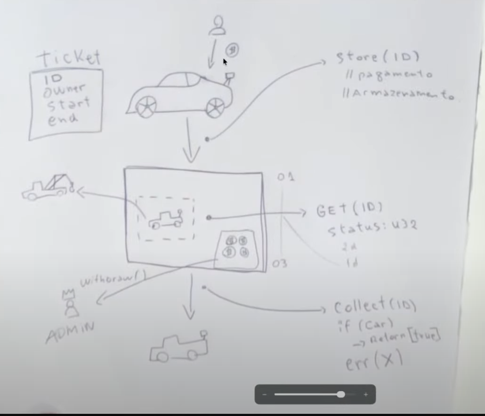

# Aula 1: Segurança em Smart Contracts

## 🎯 **O que Aprendemos**

### **Conceitos Fundamentais de Segurança**
- **TTL (Time To Live)**: Tempo de vida dos contratos e dados
- **Storage Types**: 3 tipos de armazenamento na Stellar
- **Autenticação**: Patterns de regra de acesso
- **Threat Modeling**: Modelagem de ameaças

---

## ⏰ **TTL (Time To Live)**

### **Conceito Fundamental**
- **Mecanismo** que controla o tempo de vida dos smart contracts
- **Diferença do EVM**: Contratos na Stellar **não vivem para sempre**
- **Importante**: Tempo de vida do contrato ≠ tempo de vida dos dados

### **Por que TTL Existe?**
- ✅ **Previne crescimento infinito** do ledger
- ✅ **Mantém tamanho gerenciável** do ledger ativo
- ✅ **Reduz requisitos** de armazenamento dos nós
- ✅ **Incentiva uso eficiente** dos dados
- ✅ **Permite armazenamento** de longo prazo mais barato

### **Como Funciona?**
- **Estado Ativo**: `TTL > 0` (dados acessíveis na blockchain)
- **Estado Expirado**: `TTL = 0` (dados expiram e se tornam inativos)
- **Baseado em ledgers**: Decrementa -1 a cada novo ledger (~5 segundos)

---

## 💾 **Tipos de Storage**

### **1. Instance**
- **Duração**: Permanente (até ser explicitamente deletado)
- **TTL mínimo**: 4,096 ledgers (~5.7 horas)
- **Custo**: Mais caro para manter
- **Uso ideal**: Dados críticos como saldos de tokens, configurações essenciais

### **2. Persistent**
- **Duração**: Vinculado ao contrato (todos os dados compartilham o mesmo TTL)
- **TTL mínimo**: 4,096 ledgers (~5.7 horas)
- **Custo**: Médio
- **Uso ideal**: Configurações do contrato, dados administrativos

### **3. Temporary**
- **Duração**: Curta (pode expirar rapidamente)
- **TTL mínimo**: 16 ledgers (~1.3 minutos)
- **Custo**: Mais barato
- **Uso ideal**: Cache, dados temporários, oráculos

### **Extensão de TTL**
- **Método**: `extend_ttl()` no contrato
- **Taxa**: Baseada na duração da extensão
- **Flexibilidade**: Pode estender quantas vezes quiser
- **Independência**: Cada tipo de storage pode ter TTL estendido separadamente

---

## 🔐 **Autenticação em Smart Contracts**

### **Princípios Fundamentais**
1. **Primeiro autentica, depois autoriza**
2. **É possível autenticar múltiplos usuários na mesma chamada** (diferencial do hackathon!)
3. **`_check_auth` nativo** com **pre-hooks configuráveis** para autenticação personalizada
4. **Uma falha de autenticação fará com que a transação falhe como um todo**
5. **Não é possível obter o endereço do usuário nativamente; ele precisa ser passado como parâmetro**

### **`_check_auth` - Pre-validação e Pre-hooks**
- **Pre-validação**: Executa **antes** da autenticação principal
- **Pre-hooks configuráveis**: **Webhooks** para validações personalizadas
- **Customização**: Permite **editar e customizar** o processo de autenticação
- **Integração externa**: Conecta com **sistemas externos** via webhooks
- **Flexibilidade**: Implementa **lógica customizada** de autenticação

### **Patterns de Regra de Acesso**
- **Focar bastante** nesse conceito
- **Pre-hooks configuráveis** para validações personalizadas
- **Autenticação múltipla** como diferencial competitivo

---

## 🛡️ **Threat Modeling - O Coração da Segurança**

### **Conceito Fundamental**
- **Threat Modeling** é o **coração da segurança** em smart contracts
- **4 perguntas fundamentais** que devem ser respondidas em qualquer projeto
- **Quando aplicar**: A **qualquer momento** do desenvolvimento, não apenas no final

### **As 4 Perguntas Fundamentais**
1. **O que estamos fazendo?**
2. **O que pode dar errado?**
3. **O que vamos fazer sobre isso?**
4. **Fizemos um bom trabalho?**

### **Quando Aplicar Threat Modeling**
- **Desenvolvimento avançado**: Pensar em **postmortem** para relatar processo de incidente
- **Qualquer momento**: Não apenas no final do projeto
- **Prevenção**: Antes que incidentes se tornem problemas críticos
- **Resposta a incidentes**: Pensar em **tempo de resposta** e **processo de incidente**

---

## 🗺️ **Mapeamento do Sistema**

### **Para Threat Modeling Efetivo**
Precisamos **mapear o sistema** identificando:

### **1. Entidades Externas**
- **Definição**: Sistemas ou atores **fora do controle** da aplicação/empresa
- **Exemplos**: usuários, APIs externas, serviços de terceiros
- **Importância**: Identificar **pontos de entrada** externos

### **2. Processos**
- **Definição**: Código e sistemas **sob controle** da aplicação/empresa
- **Exemplos**: serviços de backend, smart contracts, lógica de negócio
- **Importância**: Mapear **componentes internos** do sistema

### **3. Fluxo de Dados**
- **Definição**: **Movimento de dados** entre sistemas
- **Exemplos**: chamadas de API, interações com contratos, consultas ao banco de dados
- **Importância**: Entender **como os dados fluem** pelo sistema

### **4. Armazenamento de Dados**
- **Definição**: **Onde os dados persistem** no sistema
- **Exemplos**: armazenamento de contratos Soroban, bancos de dados, servidores de arquivos
- **Importância**: Identificar **pontos de persistência** e vulnerabilidades

### **5. Fronteiras de Confiança**
- **Definição**: Áreas onde as **premissas de confiança mudam** entre sistemas
- **Exemplo**: Fronteira frontend/backend onde a validação de entrada deve ocorrer
- **Importância**: **Crítico para identificar pontos de controle de segurança**

### **Mapeamento Web2 vs Web3**
- **Web2**: Foco em APIs, bancos de dados, servidores
- **Web3**: Foco em smart contracts, blockchain, carteiras, oráculos
- **Ambos**: Precisam do mesmo **mapeamento sistemático** para segurança efetiva

---

## 🎯 **STRIDE Framework - "O que pode dar errado?"**

### **S - Spoofing (Falsificação)**
- **Propriedade Violada**: Authentication
- **Definição**: Pretending to be something or someone other than yourself
- **Exemplo**: Um atacante pode se passar por outra pessoa, frequentemente aproveitando falhas na verificação do usuário final em sistemas downstream
- **Pergunta**: "O atacante poderia induzir uma ação se passando por outra pessoa?"

### **T - Tampering (Adulteração)**
- **Propriedade Violada**: Integrity
- **Definição**: Modifying something on disk, network, memory or elsewhere
- **Exemplo**: WiFi pública interceptando dados
- **Pergunta**: "O atacante poderia modificar dados em trânsito ou armazenados?"

### **R - Repudiation (Repúdio)**
- **Propriedade Violated**: Non-Repudiation
- **Definição**: Claiming that you didn't do something or we're not responsible
- **Pergunta**: "O atacante poderia negar ter realizado uma ação?"

### **I - Information Disclosure (Divulgação de Informações)**
- **Propriedade Violated**: Confidentiality
- **Definição**: Providing information to someone not authorized to access it
- **Exemplos**: 
  - **ZK (Zero Knowledge)**: Soluções para privacidade
  - **IPFS**: Armazenamento distribuído e privado (exemplo do ZK Hackathon)
  - **Dados privados na blockchain pública**: Risco de exposição
- **Pergunta**: "O atacante poderia acessar informações confidenciais?"

### **D - Denial of Service (Negação de Serviço)**
- **Propriedade Violated**: Availability
- **Definição**: Exhausting resources needed to provide service
- **Pergunta**: "O atacante poderia tornar o sistema indisponível?"

### **E - Elevation of Privilege (Elevação de Privilégio)**
- **Propriedade Violated**: Authorization
- **Definição**: Allowing someone to do something they are not authorized to do
- **Pergunta**: "O atacante poderia obter privilégios não autorizados?"

---

## 🎯 **Exemplo Prático: Sistema de Estacionamento**

### **Diagrama de Fluxo de Dados**
Antes de iniciar o código, o professor desenhou um **diagrama de fluxo de dados** para exemplificar como aplicar Threat Modeling em um sistema real.

### **Entidades do Sistema:**
- **Ticket**: ID, owner, start, end
- **User/Owner**: Usuário com carro
- **Car**: Veículo com sensor/antena
- **Admin**: Administrador com privilégios especiais
- **Tow Truck**: Reboque para veículos

### **Processos Principais:**
1. **Store (ID)**: Armazenar carro (pagamento + armazenamento)
2. **GET (ID)**: Recuperar informações (status, duração)
3. **withdraw()**: Admin remove carro (reboque)
4. **Collect (ID)**: Usuário coleta carro (verificação + retorno)

### **Fluxo de Dados:**
- **Entrada**: User + Car → Store (pagamento) → Sistema
- **Consulta**: Sistema → GET (status, duração)
- **Admin**: Admin → withdraw() → Sistema → Tow Truck
- **Saída**: Sistema → Collect (verificação) → Car

### **Aplicação do Threat Modeling:**
Este exemplo demonstra como **mapear o sistema** antes de implementar:
- **Entidades Externas**: User, Admin, Car
- **Processos**: Store, GET, withdraw, Collect
- **Fluxo de Dados**: Movimento entre entidades
- **Armazenamento**: Sistema central (smart contract)
- **Fronteiras de Confiança**: User vs Admin, pagamento vs coleta

---

## 🛠️ **"O que vamos fazer sobre isso?" - Mitigação de Ameaças**

### **Elevação de Privilégio - Foco em Testes**
- **Padrões de Segurança** (Security Standards/Patterns)
- **Testes TDD e BDD** (TDD and BDD Tests)
- **Testes fuzzy** (Fuzzy Tests)
- **Código auditado pela comunidade** (Community-audited Code)
- **Análise estática de código** (Static Code Analysis)
- **Auditorias** (Audits)

### **Regra de Ouro para Produção**
- **"Se for mandar para produção, faça uma auditoria"**
- **Nunca 100% seguro**: Em segurança, nunca estamos 100% seguros
- **Sempre revisar**: Sempre bom revisar e auditar para estar ciente
- **Assinar embaixo**: Você passaria e mandaria para produção? Você assina embaixo?

---

## 📊 **Matriz de Risco**

### **Conceito**
- **Matriz de risco** nos ajuda a **priorizar ameaças** baseadas em:
- **Probabilidade/Impacto** para tomada de decisão

### **Níveis de Risco**
- **�� Alto**: **Ação imediata necessária**
- **🟡 Médio**: **Planejar mitigação**
- **�� Baixo**: **Monitorar**

### **Matriz 5x5**
- **Probabilidade**: Raro → Improvável → Possível → Provável → Muito Provável
- **Impacto**: Muito Baixo → Baixo → Médio → Alto → Muito Alto
- **Colorização**: Verde (baixo risco) → Amarelo (médio risco) → Vermelho (alto risco)

---

## ✅ **"Fizemos um bom trabalho?" - Validação**

### **4 Perguntas de Validação**
1. **O diagrama de fluxo de dados foi referenciado desde sua criação?**
2. **O modelo STRIDE revelou novos problemas ou preocupações de design que não haviam sido previamente abordados ou considerados?**
3. **Os tratamentos identificados na seção "O que vamos fazer sobre isso" abordaram adequadamente os problemas identificados?**
4. **Foram encontrados problemas adicionais após o modelo de ameaças?**

### **Mentalidade de Segurança**
- **"Você está seguro sobre isso?"** - Questionar constantemente
- **"Se alguém perguntar sobre um código, você passaria e mandaria para produção?"**
- **"Você assina embaixo?"** - Responsabilidade pessoal
- **"Nunca 100% seguro"** - Em segurança, nunca estamos 100% seguros
- **"Sempre revisar"** - Sempre bom revisar, auditar para estar ciente

---

## 💡 **Dicas Importantes do Professor Lucas**

### **Para o Meridian Hackathon**
- **Threat Modeling** é diferencial competitivo
- **Mapeamento sistemático** do sistema antes do desenvolvimento
- **STRIDE framework** para identificar vulnerabilidades
- **Fronteiras de confiança** são críticas para segurança
- **Autenticação múltipla** na mesma chamada é diferencial competitivo
- **`_check_auth`** com **pre-hooks configuráveis** para autenticação personalizada
- **Pre-validação customizada** via webhooks configuráveis
- **Focar em patterns de regra de acesso** para projetos robustos
- **"Se for mandar para produção, faça uma auditoria"**
- **"Você assina embaixo?"** - Responsabilidade pessoal pelo código

### **Mentalidade de Segurança**
- **"Pensar como engenheiro de segurança"** - elevar nível profissional
- **"Threat Modeling é o coração da segurança"** - aplicar desde o início
- **"Prevenção é melhor que correção"** - evitar que incidentes se tornem críticos
- **"Conceitos que não desaparecem"** - fundamentos permanentes
- **"Taxa de transmissão"** - condensar conhecimento eficientemente
- **"Nunca 100% seguro"** - Em segurança, nunca estamos 100% seguros
- **"Sempre revisar"** - Sempre bom revisar, auditar para estar ciente

---

## **Próximos Passos**

### **Aula 2: Composabilidade**
- Interação entre contratos na Stellar
- Padrões de composição (DeFi-like)
- Orquestração de múltiplos contratos

### **Aula 3: Passkey Authentication**
- WebAuthn e padrões FIDO
- Integração com smart contracts
- Experiência de usuário sem seed phrases

---

## 📚 **Recursos Adicionais**

### **Documentação**
- [Soroban Security](https://soroban.stellar.org/docs/security)
- [Stellar Smart Contracts](https://soroban.stellar.org/)
- [TTL Documentation](https://soroban.stellar.org/docs/fundamentals-and-concepts/state-archival)

### **Ferramentas**
- **Analisador estático** para Stellar/Soroban (similar ao Slither para EVM)
- **Passkey (PSK)**: Padrão para autenticação biométrica
- **Curva ED25519**: Diferente da SECP256K1 do Ethereum

---

*Workshop 3, Aula 1 - Segurança em Smart Contracts*  
*Resumo dos entendimentos da aula*  
*Professor: Lucas Oliveira (Nerex Education)*